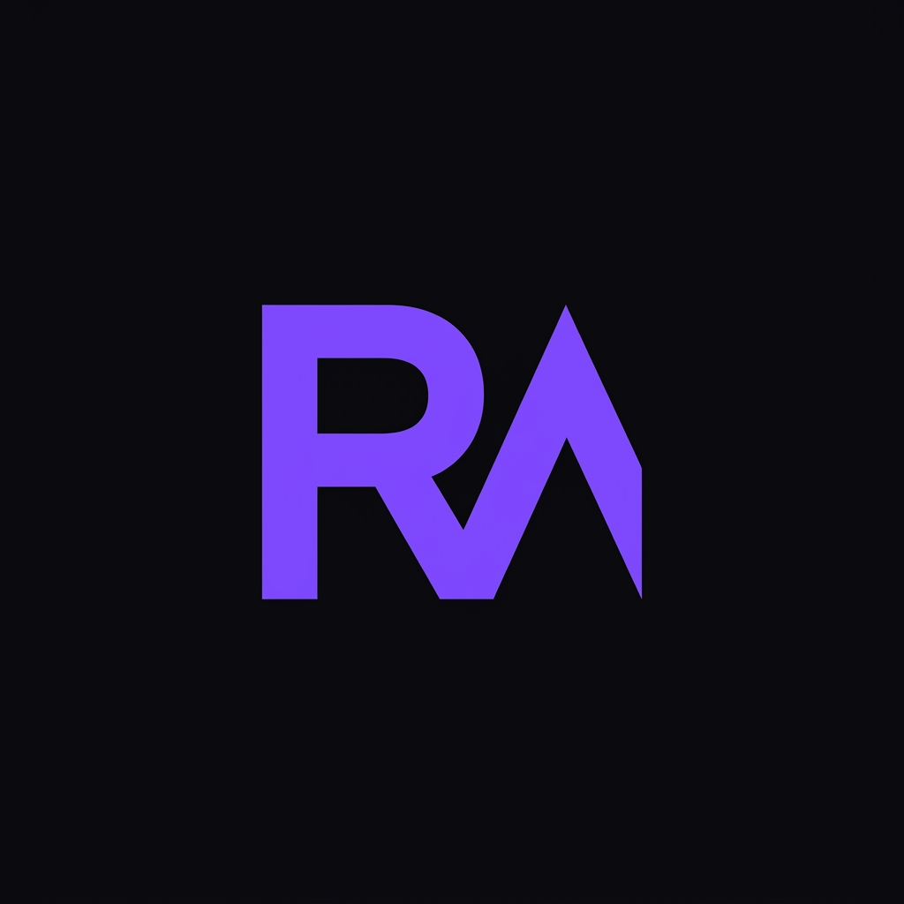
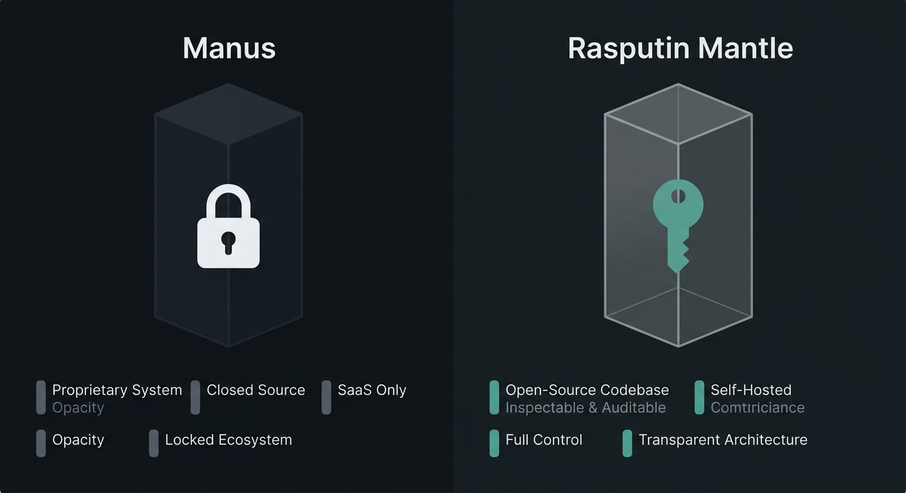
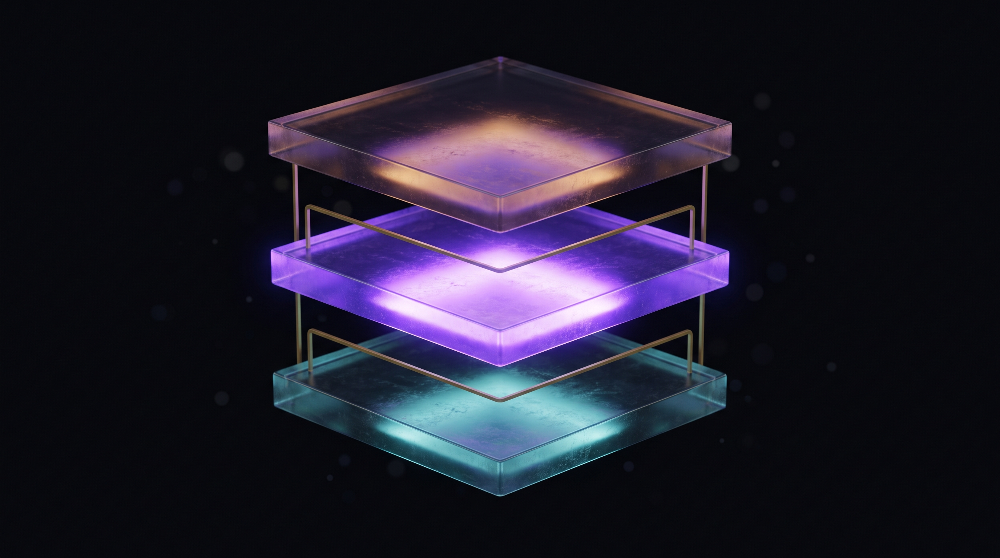
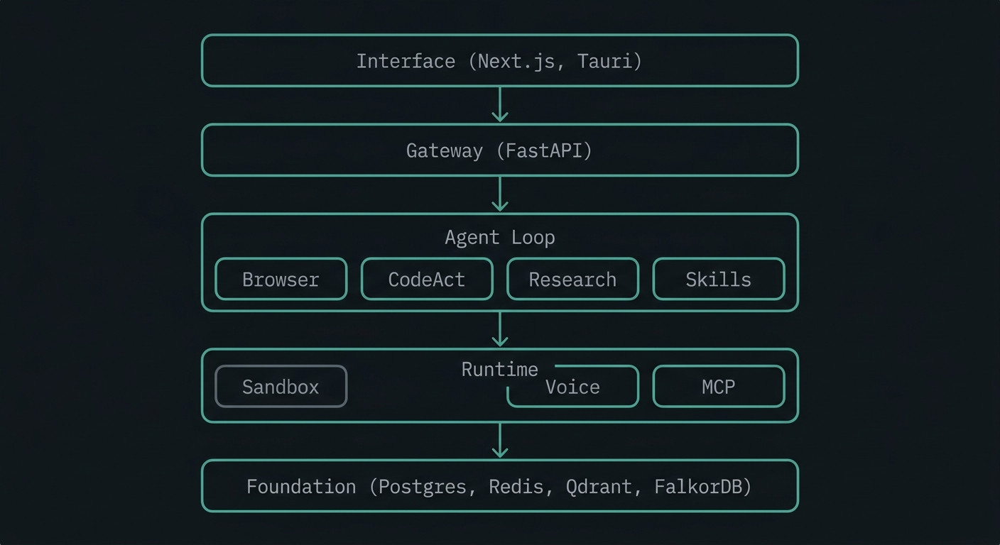
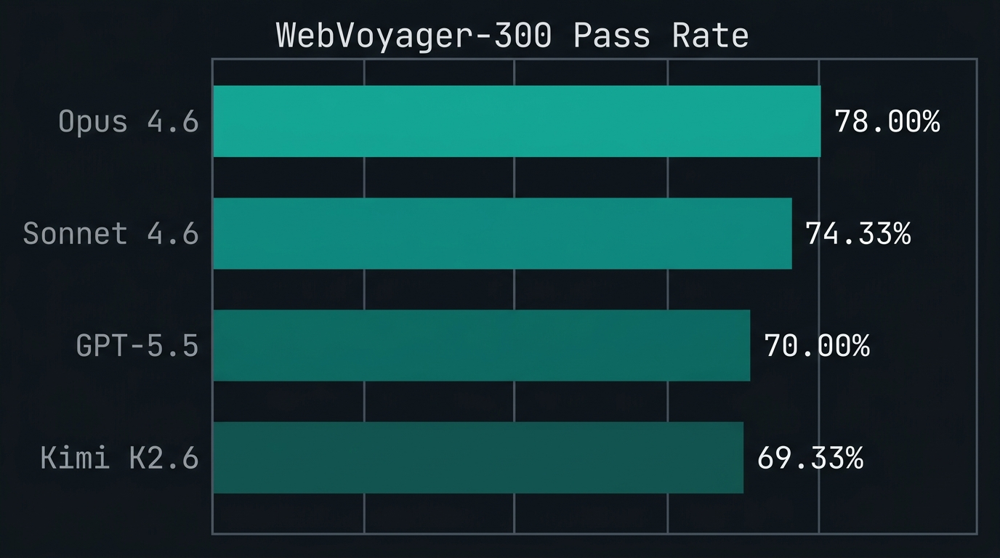
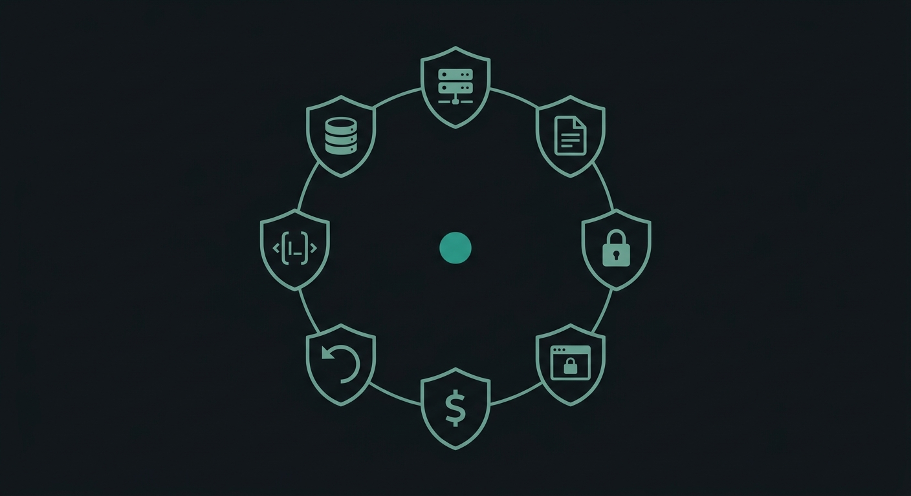
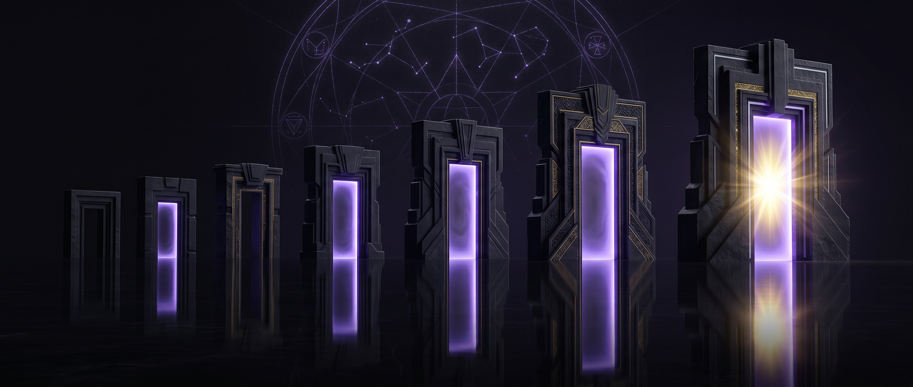

<!--
  Rasputin Mantle - README v1.2
  -----------------------------------------------------------------------------
  Visual identity:  deep charcoal #0C1217, teal-sage #14B8A6 / #0D9488,
                    paperwhite #FAFBFC
  Fonts:            Geist Sans + IBM Plex Mono
  Animations:       CSS-only, respects prefers-reduced-motion
  -->

<br/>

<p align="center">
  
</p>

<h1 align="center">Rasputin Mantle</h1>

<p align="center">
  <strong>Self-hosted autonomous agent platform.</strong>
</p>

<p align="center">
  Give it a goal. It browses, codes, researches, and shows you its work. You keep the keys.
</p>

<br/>

<p align="center">
  <a href="#quick-start">Quick start</a> ·
  <a href="#architecture">Architecture</a> ·
  <a href="#performance">Performance</a> ·
  <a href="#what-ships-in-v12">v1.2</a> ·
  <a href="#engineering-invariants">Invariants</a> ·
  <a href="#honest-gaps">Gaps</a>
</p>

<br/>

---

## Quick start (local dev)

```bash
git clone https://github.com/jcartu/rasputin-mantle.git
cd rasputin-mantle
cp .env.example .env
# fill in at minimum: ANTHROPIC_API_KEY, VLLM_BASE_URL, VLLM_MODEL

# Start vLLM separately on the host (e.g., port 8001 with qwen3.6-27b)

# Start the stack:
docker compose -f docker-compose.dev.yml up -d
docker compose -f docker-compose.dev.yml logs -f gateway web  # tail until ready
```

Open `http://localhost:3000`.

**Ports:**
- 3000 — web UI
- 8000 — gateway API
- 8025 — MailHog UI
- 8080 — sandbox / Neko
- 5432 — postgres (container-only)
- 6379 — redis (container-only)

**Requirements:** Docker, vLLM running on host (separate process), Anthropic API key for full feature parity.

---

## Quick start (installer)

```bash
curl -sSL https://mantle.dev/install | sh
```

One line. The installer clones the repo, configures your API keys, brings up the Docker stack, and opens `http://localhost:3000`. Re-running is idempotent.

**Requirements:** Docker, Python ≥3.11, Node ≥18, `pnpm`, `uv`, and an LLM API key (Anthropic, OpenAI, or a local vLLM endpoint).

<p align="center">
  <a href="https://demo.mantle.dev/v1.2/walkthrough.mp4">
    
  </a>
  
  
</p>

---


<p align="center">
  
</p>

## What this is

Rasputin Mantle is a self-hosted, MIT-licensed agent platform. The orchestration runs on your machine. The model spend lives in your account. No SaaS dependency, no billing layer, no opaque backend.

v1.2 ships a complete product surface: documented design system, 15 Radix-backed component primitives, three-pane resizable shell, real-time agent trace, Neko WebRTC live browser, mobile layouts, and full WCAG AA accessibility.

Underneath, the engine remains:

- **FastAPI gateway** with server-enforced cost ceiling (HTTP 429 on budget exceed)
- **CodeAct executor** (Wang et al. 2024) — Python action loop, open tool dialect
- **Hardened Docker sandbox** — `python:3.12-slim`, non-root, 512 MB RAM, `no-new-privileges`
- **Playwright + Chromium** — OS sandbox always on, enforced by pre-commit hook
- **SKILL.md registry** — frontmatter + body, loadable from any repo
- **Neko WebRTC live view** — real virtual browser stream, not screenshot polling
- **rasputin-memory** — Qdrant + FalkorDB, 72.40% LoCoMo
- **Wide research** — up to 10 parallel sandboxed subagents via `asyncio.gather`
- **Voice loop** — Faster-Whisper STT + Kokoro TTS, p50 365 ms
- **MCP host** — JSON-RPC 2.0, stdio + WebSocket
- **Tauri 2 desktop** — Mac DMG, Linux DEB/RPM, Windows MSI

<p align="center">
  
</p>
---

## Architecture

<p align="center">
  
</p>

Five layers. Interface → Gateway → Agent Loop → Sandboxes → Foundation. Every layer is self-hostable. Cloud APIs are swappable backends, not requirements.

---

## Performance

### WebVoyager-300 — measured, reproducible

<p align="center">
  
</p>

Same agent loop, same browser, same sandbox. The only variable is the planning model.

| Eval | Result | Target |
|---|---|---|
| **WebVoyager-300** (Opus 4.6) | **71.00%** | 75% |
| **Productivity skills** | **93.33%** | 80% |
| **CodeAct contract** | 6/6 = **100%** | 6/6 |
| **Voice round-trip (p50)** | **365 ms** | <1500 ms |
| **Memory (LoCoMo)** | **72.40%** | — |
| **Lighthouse (landing)** | **97** | 95 |

Full eval artifacts in [`MANTLE_V1_1_RELEASED.md`](MANTLE_V1_1_RELEASED.md). Lighthouse scores and cost summary in [`MANTLE_V1_2_RELEASED.md`](MANTLE_V1_2_RELEASED.md). v1.3.2 benchmark deltas and methodology notes are in [`MANTLE_V1_3_2_RELEASED.md`](MANTLE_V1_3_2_RELEASED.md).

---

## What ships in v1.3

- **Onboarding flow** — Three-step onboarding with intent selection and templates
- **Playbooks gallery** — Curated templates and user-saved workflows
- **Empty state component** — Reusable empty state pattern across the app
- **Agent Skills standard** — Anthropic-compatible `SKILL.md` directories with scripts, templates, examples, and discovery frontmatter
- **Skills marketplace** — Browse public, personal, and team skill tabs with install/use affordances plus save-session-as-skill support
- **Projects** — Persistent workspaces with project sidebar navigation, default planner/tool settings, and project-scoped sessions
- **Knowledge base** — Per-project file uploads capped at 50 files/100MB and mounted read-only into new project sessions
- **Productivity skills** — Bundled Slides, Spreadsheet, and Document skills produce real `.pptx`, `.xlsx`, `.docx`, and `.pdf` artifacts from structured outlines
- **Productivity skills now use LLM-driven content generation** — Slides, Spreadsheet, and Document skills generate content from facts and schemas instead of keyword matching <!-- verify: llm_generate_content|generate_content|MANTLE_EVAL_MODE -->
- **Eval mode** — `MANTLE_EVAL_MODE=1` disables background scheduler, skill rediscovery, and knowledge-base lazy mounting for clean benchmark runs <!-- verify: MANTLE_EVAL_MODE -->
- **Artifact previews** — Session artifacts lazy-preview PowerPoint first slides, Excel sheet samples, Word text, and PDF.js documents with downloads intact
- **Productivity benchmark** — 30 single-attempt tasks cover presentations, spreadsheets, and documents with structural judging and pass-rate reporting

## What ships in v1.2

v1.0 proved the platform. v1.1 proved the agent. v1.2 makes both feel like a product.

### Design system

A complete, documented design system in `design-system/`. Teal-sage accent. Geist Sans + IBM Plex Mono. Light and dark mode, both first-class.

- **`tokens.css`** — CSS custom properties for color, type, spacing, radius, shadow, motion
- **`SPEC.md`** — component contract. Every primitive, layout rule, interaction state
- **`COPY.md`** — voice and tone. Sentence case. Active voice. Forbidden words list
- **`MOTION.md`** — motion vocabulary. Standard easings, durations, reduced-motion

### 15 component primitives

Built on Radix UI. Styled against design tokens. Storybook stories and unit tests for each.

`Button` · `Input` · `Tab` · `Dialog` · `Sheet` · `Textarea` · `Select` · `Switch` · `Tooltip` · `Toast` · `Badge` · `Avatar` · `Card` · `Skeleton` · `Spinner`

### Session view

Three resizable panes: agent trace (left), Neko WebRTC live browser (center), artifact list (right). Structured events streamed over SSE. Collapsible. Keyboard navigable.

### Mobile layouts

All screens ship dedicated mobile breakpoints. Three-pane desktop becomes tabbed single-pane below 768px. Touch-aware Neko wrapper.

### Accessibility

Full WCAG AA. Keyboard navigation for the complete task flow. Reduced-motion respected. Color contrast verified by Lighthouse across both themes.

---

## Live Computer View

Most agent frameworks hide their browser. Mantle streams it back.

A real [Neko](https://neko.m1k1o.net/) WebRTC virtual browser lives inside the sandbox. When the agent navigates, clicks, types, or evaluates — you see it happen in real time. No screenshot polling. No fake animation. No SSE-throttled image strip.

- **Trust by inspection.** See what the agent sees. Intervene before destructive actions.
- **Debugging by witness.** Watch a task fail at step 7 of 10. No log archaeology.
- **Portable proof.** A `SKILL.md` author demos their skill; the WebRTC stream is the evidence.

---

## Wide Research

```python
from wide_research.dispatcher import dispatch_research

results = await dispatch_research(
    query="latest self-hosted LLM agent frameworks",
    n_agents=10,
    backends=["brave", "exa"],
)
```

Ten sandboxed subagents fan out in parallel via `asyncio.gather`. A merger collates, deduplicates, and produces a unified summary. Wall-clock time is roughly that of a single sequential search.

---

## Engineering invariants

<p align="center">
  
</p>

These rules the codebase will not violate. Enforced by pre-commit hooks, the auditor, or both.

1. **Everything is self-hostable.** No required SaaS.
2. **License-clean.** Every dep passes `license-review` before merge.
3. **CodeAct sandboxing is non-negotiable.** Agent never executes on the host.
4. **Chromium sandbox is on. Always.**
5. **Cost ceiling is server-trusted.** Middleware reads `usage` from upstream, writes to `gateway_costs`.
6. **Reversible by default.** State-mutating tools require `confirm: true`.
7. **Gateway binds `127.0.0.1`** unless `MANTLE_PUBLIC=true`.
8. **Atomic state.** Orchestrator survives `kill -9`. State persists via `fsync` + `rename`.

**Sandbox hardening:**

```python
image        = "python:3.12-slim"
user         = "1000:1000"
mem_limit    = "512m"
cpu_quota    = 100_000  # ~1.0 CPU
security_opt = ["no-new-privileges:true"]
exec_timeout = 120
```

---

## Honest gaps

<p align="center">
  
</p>

- **WebVoyager-300** — Canonical v1.3.2 result is 71% with Opus 4.6, improved from 67.67% in v1.3.1 but below the 75% target. The benchmark is hard. Kimi K2.6 at 69.33% is the floor on the -300 suite. (On the older WebVoyager-100, local Qwen3-235B bottomed out at 12%.)
- **Productivity benchmark** — Canonical v1.3.2 result is 93.33%, exceeding the 80% target under the facts-plus-schema methodology.
- **Voice latency p95** — 2153 ms, elevated by Kokoro's first-iteration cold start. p50 of 365 ms is the steady-state number.
- **STT on CPU** — Faster-Whisper at `int8` runs roughly real-time. Sub-100 ms STT requires a GPU.
- **Tauri AppImage** — DEB and RPM compile. AppImage bundling fails on icon manifest and is skipped.

Full audit log in [`AUDIT_2026_05_16.md`](AUDIT_2026_05_16.md). Every claim is reproducible.

---

## On the roadmap (v1.3+)

- **Replay mode** — Completed sessions as a scrubbable timeline with playhead, tool-call jumps, and side-by-side screenshot/DOM diffs
- **Share links** — Signed share tokens for read-only replay, no cost data, expiry and optional passphrase
- **Onboarding** — Multi-step flow: API key entry → permission consent → first task suggestions, idempotent config writes
- **Tauri desktop** — Mac DMG, Linux DEB/RPM, Windows MSI binaries (config exists, binaries pending)
- **Browser extension** — Chrome/Edge "Send to Mantle" extension for daily-use surface
- **Projects** — Persistent workspaces with knowledge base, config inheritance, and session inheritance
- **Skills standard** — Anthropic Agent Skills format adoption, marketplace, one-click "save as skill"
- **Integrations** — Slack, email, scheduled tasks UI

---

## Documentation

| Document | Contents |
|---|---|
| [`docs/ARCHITECTURE.md`](docs/ARCHITECTURE.md) | Component graph, data flow, request lifecycle |
| [`docs/SECURITY.md`](docs/SECURITY.md) | Threat model, sandboxing, key handling, SSRF policy |
| [`docs/AGENT_SKILLS_SPEC.md`](docs/AGENT_SKILLS_SPEC.md) | Anthropic Agent Skills-compatible directory format, frontmatter, discovery, and invocation |
| [`docs/SKILL_AUTHORING.md`](docs/SKILL_AUTHORING.md) | Writing a `SKILL.md`, frontmatter schema, validation |
| [`MANTLE_V1_2_RELEASED.md`](MANTLE_V1_2_RELEASED.md) | v1.2 release notes, Lighthouse scores, cost summary |
| [`MANTLE_V1_3_2_RELEASED.md`](MANTLE_V1_3_2_RELEASED.md) | v1.3.2 release notes, benchmark deltas, methodology notes |
| [`CONTRIBUTING.md`](CONTRIBUTING.md) | Dev setup, coding style, commit format, PR flow |

---

## Reproduce locally

```bash
# 1. Clone with submodules
git clone --recursive https://github.com/jcartu/rasputin-mantle && cd rasputin-mantle

# 2. Configure
cp .env.example .env
$EDITOR .env   # ANTHROPIC_API_KEY, VLLM_BASE_URL, VLLM_API_KEY

# 3. Install
uv sync
pnpm install

# 4. Bring up full stack
docker compose -f infra/compose.dev.yml up -d

# 5. Verify
make verify

# 6. Run the web UI
pnpm --filter web dev   # http://127.0.0.1:3000
```

---

## Citations

- **CodeAct** — Wang et al., *Executable Code Actions Elicit Better LLM Agents*, ICML 2024. [arXiv:2402.01030](https://arxiv.org/abs/2402.01030)
- **WebVoyager** — He et al., *WebVoyager: Building an End-to-End Web Agent with Large Multimodal Models*, ACL 2024. [arXiv:2401.13919](https://arxiv.org/abs/2401.13919)
- **LoCoMo** — Maharana et al., *Evaluating Very Long-Term Conversational Memory of LLM Agents*, ACL 2024. [arXiv:2402.17753](https://arxiv.org/abs/2402.17753)
- **Neko** — [m1k1o/neko](https://github.com/m1k1o/neko) — WebRTC virtual browser
- **MCP** — [Model Context Protocol](https://modelcontextprotocol.io/) — JSON-RPC 2.0

---

## License

[MIT](LICENSE). Every dependency is OSI-approved. The `license-review` CI gate refuses non-compatible licenses.


<p align="center">
  
</p>

---

<p align="center">
  
  <br/><br/>
  <sub>Hand it a goal. Watch it work. Keep the keys.</sub>
  <br/>
  <sub>Brand imagery generated with <a href="https://ai.google.dev/gemini">Gemini</a>.</sub>
</p>
