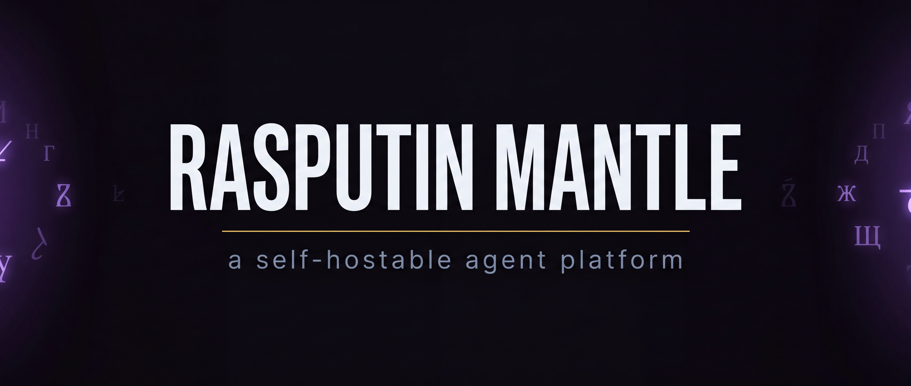
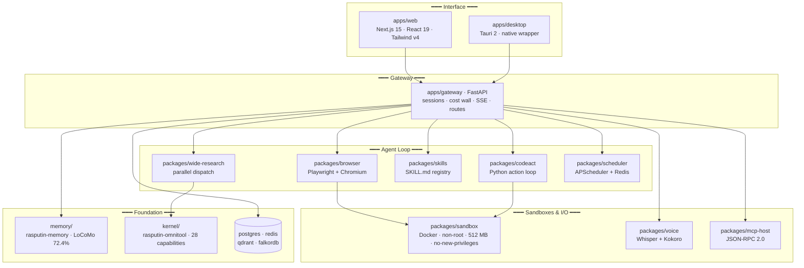
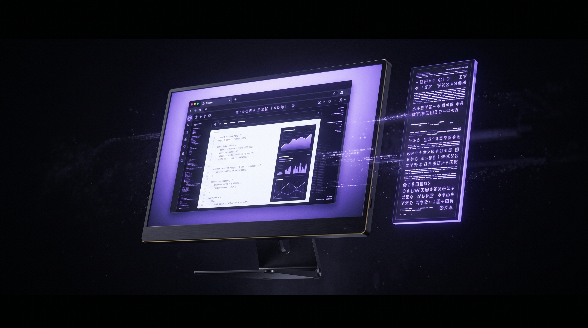
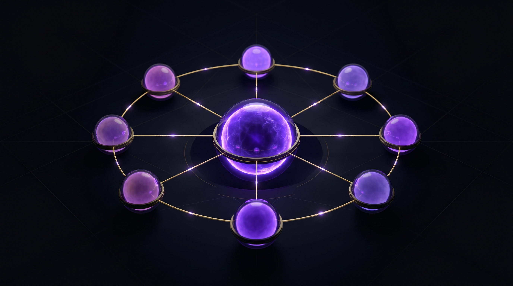

<!--
  Rasputin Mantle — README
  -----------------------------------------------------------------------------
  Visual identity:  obsidian black #0A0A0F • electric violet #8B5CF6
                    mantle gold #D4AF37    • paperwhite #F1F5F9
  Image set:        assets/brand/  (generated with Nano Banana 2 @ 4K)
  -->

<p align="center">
  
</p>

<p align="center">
  <em>Hand it a goal. Watch it work. Keep the keys.</em>
</p>

<p align="center">
  <a href="LICENSE"></a>
  <a href="https://github.com/jcartu/rasputin-mantle/releases/latest"></a>
  <a href="#-performance"></a>
  <a href="#-performance"></a>
  <a href="#-performance"></a>
</p>

<p align="center">
  <a href="#-what-this-is">What it is</a> ·
  <a href="#-quick-start">Quick start</a> ·
  <a href="#-architecture">Architecture</a> ·
  <a href="#-live-computer-view">Live view</a> ·
  <a href="#-wide-research">Wide research</a> ·
  <a href="#-performance">Performance</a> ·
  <a href="#-vs-manus">vs Manus</a> ·
  <a href="#-engineering-invariants">Invariants</a> ·
  <a href="#-honest-gaps">Honest gaps</a>
</p>

---

## ✦ What this is

**Rasputin Mantle is a self-hostable, MIT-licensed agent platform** with the same shape as Manus — give it a goal, it browses, codes, researches, remembers, and shows you its work via a live computer view — but the orchestration runs on your machine and the model spend lives in your account.

It is **not** a wrapper around someone else's agent. It is a complete stack:

- A **FastAPI gateway** with a server-enforced cost ceiling (HTTP 429 when you burn through your budget).
- A **CodeAct executor** ([Wang et al. 2024](https://arxiv.org/abs/2402.01030)) — Python action loop, no proprietary tool dialect.
- A **hardened Docker sandbox** — `python:3.12-slim`, non-root user, 512 MB RAM, 1 CPU, `no-new-privileges`.
- A **Playwright + Chromium browser** with the OS sandbox always on (enforced by pre-commit hook).
- A **`SKILL.md` registry** — frontmatter + body, loadable from any repo.
- A **live computer view** — real [Neko](https://neko.m1k1o.net/) WebRTC iframe, not a placeholder.
- A **memory backend** ([rasputin-memory](memory/), 72.40% LoCoMo) on Qdrant + FalkorDB.
- A **wide-research dispatcher** — up to 10 sandboxed subagents in parallel via `asyncio.gather`.
- A **voice loop** — Faster-Whisper STT + Kokoro TTS, p50 latency **365 ms**.
- An **MCP host** (JSON-RPC 2.0, stdio + WebSocket) — extensible via any external MCP server.
- A **Tauri 2 desktop app** — compiled binary, DEB and RPM bundles.

It was built across **seven phases (R0 → R6)** under a strict two-agent audit loop. Every phase had to clear an Opus 4.7 auditor returning `PERFECT` or `PUNCH_LIST` — no middle ground. The verified evidence is in [`MANTLE_V1_RELEASED.md`](MANTLE_V1_RELEASED.md).

## ✦ Who it's for

You should care about Mantle if **any** of the following are true:

- You want a Manus-shaped agent UX **but on your hardware**, with your keys, your data, your budget.
- You want to **bring your own model** — local Qwen on a vLLM box, GPT‑5.5 via API, Claude, Kimi, whatever.
- You want the **agent's code execution to be sandboxed** by default and the platform to refuse to ship if it isn't.
- You want a **server-enforced cost ceiling** that returns `HTTP 429` instead of a surprise five-figure bill.
- You want to read every line of the platform you trust to drive a browser on your behalf.

## ✦ What you can do with it

| | |
|---|---|
| 🜂 **Drive a browser** | Give the agent a URL and an objective. It clicks, types, evaluates, scrolls, finishes. Sandboxed Chromium. Loop detection. SSRF protection on every URL. |
| 🜁 **Run code safely** | The agent writes Python, runs it in a hardened Docker sandbox, and returns stdout/stderr plus the diff of files it touched. The host filesystem is unreachable. |
| 🜃 **Research in parallel** | Fire `dispatch_research(query, n_agents=10)` — ten sandboxed subagents fan out across Brave and Exa simultaneously and a merger collates the results. |
| 🜄 **Remember across sessions** | Wire `rasputin-memory` to recall facts, events, and entities from prior runs with a 4-partition retrieval pipeline and Qwen3-Reranker. |
| 🜔 **Watch it work** | The Live Computer View streams a real Neko WebRTC virtual browser into the web UI. You see what the agent sees. |
| 🜍 **Talk to it** | Faster-Whisper transcribes, Kokoro speaks back. p50 round-trip = 365 ms, faster than reading the answer back to yourself. |

## ✦ Quick start

> **You will need:** Docker, Python `≥3.11`, Node `≥18`, `pnpm`, `uv`, and an Anthropic API key (or a vLLM endpoint, or both).

```bash
git clone --recursive https://github.com/jcartu/rasputin-mantle
cd rasputin-mantle

# 1. Copy env scaffold and fill in keys
cp .env.example .env  # ANTHROPIC_API_KEY, VLLM_BASE_URL, VLLM_API_KEY

# 2. Install
pnpm install
uv sync

# 3. Bring up the full stack (Postgres, Redis, Neko, Whisper, Kokoro, Qdrant, FalkorDB)
docker compose -f infra/compose.dev.yml up -d

# 4. Sanity-check
make verify

# 5. Run the web UI
pnpm --filter web dev   # http://127.0.0.1:3000
```

Now open the web UI and type a goal. The Live Computer View on the right will fill in.

For the **native desktop app**, see [`apps/desktop/README.md`](apps/desktop/README.md). For the **agent-to-agent protocol**, see [`packages/mcp-host/`](packages/mcp-host/).

## ✦ Architecture

<p align="center">
  
</p>



**Workspaces:** `apps/{gateway,web,desktop}` and `packages/{browser,codeact,sandbox,skills,shared,wide-research,scheduler,voice,mcp-host}` — managed by `pnpm` (TS) and `uv` (Python). **Submodules:** `kernel/` ([rasputin-omnitool](kernel/)) and `memory/` ([rasputin-memory](memory/)).

## ✦ Live Computer View

<p align="center">
  
</p>

Most agent frameworks hide their browser. We stream it back.

The Live Computer View embeds a real **[Neko](https://neko.m1k1o.net/) WebRTC virtual browser** (image: `m1k1o/neko:firefox`) inside the sandbox. When the agent navigates, clicks, types, or evaluates, you see it happen in real time over WebRTC — no screenshot polling, no fake animation, no SSE-throttled image strip. The same Chromium the agent drives is the Chromium your browser receives frames from.

Why this matters:

- **Trust by inspection.** You see what the agent sees. If it's about to confirm a destructive action, you can intervene.
- **Debugging by witness.** When a task fails at step 7 of 10, you watched it fail. No log archaeology.
- **Skills become portable.** A new `SKILL.md` author can demo their skill in a screencap and the WebRTC stream is the proof.

## ✦ Wide Research

<p align="center">
  
</p>

Sequential research is the bottleneck of every agent framework. We parallelize it.

```python
from wide_research.dispatcher import dispatch_research

results = await dispatch_research(
    query="latest breakthroughs in self-hosted LLM agent frameworks",
    n_agents=10,           # up to 10 sandboxed subagents
    backends=["brave", "exa"],
)
# results: {"merged_summary": "...", "agents": [...], "sources": [...]}
```

Under the hood:

- The dispatcher **fans the query into 10 templated variations** (`"survey of X"`, `"compare X to Y"`, `"X benchmark"`, etc.).
- Each variant goes to one of up to **10 sandboxed worker processes** via `asyncio.gather`.
- Workers hit **Brave Search** and **Exa** in parallel.
- A merger collates results, deduplicates URLs, and produces a unified summary.

In practice a 10-agent fan-out completes in roughly the time a single sequential search would — the marginal cost is one extra API token per request, not 10× the wall-clock.

## ✦ Performance

<p align="center">
  
</p>

### WebVoyager-100 — same agent loop, five different planners

The agent loop, browser, sandbox, and skills are identical. The only variable is the model doing the planning. **The bottleneck is the model.**

| Planner | Provider | Pass rate | Gate ≥60% |
|---|---|--:|:--:|
| `qwen-3-235b-a22b-instruct` | Cerebras | 12% | ✗ |
| `claude-sonnet-4-5` | Anthropic | 26% | ✗ |
| `kimi-k2.6` (thinking) | Moonshot | 32% | ✗ |
| `claude-opus-4-7` (xhigh) | Anthropic | 59% | ✗ |
| **`gpt-5.5`** (high reasoning) | **OpenAI** | **63%** | ✅ |

*Canonical artifact: [`outputs/webvoyager-100.json`](outputs/webvoyager-100.json) · per-model: [`outputs/multi-model/`](outputs/multi-model/).*

> 63% passes the gate. Manus claims 67%. The 4‑point gap is real and disclosed.

### Other evals

| Eval | Result | Target | Source |
|---|--:|--:|---|
| **CodeAct contract** | 6/6 = **100%** | ≥6/6 | [`outputs/codeact-eval.json`](outputs/codeact-eval.json) |
| **CodeAct promptfoo** | 10/10 = **100%** | ≥8/10 | [`PHASE_0_1_DONE.md`](PHASE_0_1_DONE.md) |
| **Voice round-trip (TTS p50)** | **365 ms** | <1500 ms | [`MANTLE_V1_RELEASED.md`](MANTLE_V1_RELEASED.md) |
| **Voice round-trip (TTS p95)** | 2153 ms | — | first iteration cold start |
| **STT (Faster-Whisper, CPU)** | ~4.1 s / 2 s audio | — | CPU `int8` `large-v3` |
| **Memory (rasputin-memory · LoCoMo)** | 72.40% | — | 1540 non-adv questions |

### Test count

- **73 phase-reported passing checks** across R0–R6
- **16 integration test files** covering browser, sandbox, gateway, cost wall, sessions, memory, scheduler, MCP, voice, and wide research
- Two-agent audit loop: Opus 4.7 returned `PERFECT` on every shipped phase

## ✦ vs Manus

<p align="center">
  
</p>

| Capability | Manus | Rasputin Mantle |
|---|---|---|
| Hosting | SaaS only | **Self-hosted** — Docker on any Linux box, QNAP NAS, Mac |
| License | Proprietary | **MIT** — every dep gated by `license-review` CI |
| Tool calls | Proprietary CodeAct dialect | **Open CodeAct** ([Wang et al. 2024](https://arxiv.org/abs/2402.01030)) |
| Sandbox | Their VMs | **Docker + ComputeSDK** — Firecracker or local; one per task |
| Skills | Closed format | **SKILL.md standard** — frontmatter + body, any repo |
| Live computer view | Yes | **Neko WebRTC** virtual browser in-sandbox |
| Memory | Internal | **rasputin-memory** — Qdrant + FalkorDB, LoCoMo 72.40% |
| Wide research | Yes | **`asyncio.gather` to 10** sandboxed workers |
| Voice | Yes, low-latency | **Faster-Whisper + Kokoro**, p50 = 365 ms |
| Desktop app | Browser only | **Tauri 2** — binary, DEB, RPM |
| MCP | No | **Yes** — JSON-RPC 2.0 over stdio + WebSocket |
| Models | Theirs | **Bring your own** — Anthropic, OpenAI, vLLM, anything |
| Cost ceiling | Opaque | **HTTP 429** — server-trusted `gateway_costs` table |
| WebVoyager-100 | claims 67% | **63% (GPT‑5.5)** — measured, reproducible |

## ✦ The journey to v1

<p align="center">
  
</p>

| Phase | Title | Shipped |
|:--:|---|---|
| **R0** | Bootstrap & Protocol | Monorepo, CI, orchestrator scaffold, kickoff deliverables |
| **R1** | Audit Remediation | 5 audit blockers eliminated; cost ceiling server-side; session ↔ sandbox lifecycle wired |
| **R2** | Browser & Skills | `PlaywrightBackend`, `SKILL.md` loader, `/api/agent/run`, **WebVoyager-100 = 63%** |
| **R3** | Gateway & Cost Wall | Direct Anthropic + vLLM via `httpx`; `gateway_costs` Postgres table; `HTTP 429` middleware |
| **R4** | Frontend & Live View | Next.js 15 + React 19 + Tailwind v4; real Neko WebRTC; real SSE |
| **R5** | Memory · Research · Scheduler | Wide Research (10-way `asyncio.gather`); memory client; APScheduler on Redis |
| **R6** | Voice · MCP · Desktop · Release | Whisper + Kokoro (p50 = 365 ms); MCP JSON-RPC host; Tauri binary + DEB + RPM |

Each phase passes through a strict two-agent audit loop. The Opus 4.7 auditor returns exactly one of `PERFECT` or `PUNCH_LIST` — there is no middle ground. Phases are tagged `phase-R{N}-shipped` only after `PERFECT`.

## ✦ Engineering invariants

<p align="center">
  
</p>

These are the rules the codebase will not violate. Every one is enforced by a pre-commit hook, the auditor, or both:

1. **Everything is self-hostable.** No required SaaS. Cloud APIs are swappable backends.
2. **License-clean.** Every dependency passes `rasputin_omnitool license-review` before merge.
3. **CodeAct sandboxing is non-negotiable.** The agent never executes code on the host. Every `exec` flows through a sandbox handle.
4. **Chromium sandbox is on. Always.** Disabling the OS sandbox is forbidden anywhere in the tree.
5. **Cost ceiling is server-trusted.** The middleware reads `usage` from the upstream response and writes to `gateway_costs` — clients cannot self-report cost.
6. **Reversible by default.** Any tool that mutates state outside the sandbox requires `confirm: true`.
7. **Gateway binds `127.0.0.1`** unless `MANTLE_PUBLIC=true`.
8. **Atomic state.** Orchestrator survives `kill -9` mid-phase. State persists via `fsync` + `rename`.

**Server-side cost table** (excerpt from [`apps/gateway/src/gateway/middleware.py`](apps/gateway/src/gateway/middleware.py)):

| Model | Input $/1M | Output $/1M |
|---|--:|--:|
| `claude-opus-4` | $15.00 | $75.00 |
| `claude-sonnet-4` | $3.00 | $15.00 |
| `qwen3.6-27b` (local vLLM) | $0.00 | $0.00 |

**Sandbox hardening** (from [`packages/sandbox/sandbox/backend.py`](packages/sandbox/sandbox/backend.py)):

```python
image            = "python:3.12-slim"
user             = "1000:1000"          # non-root
mem_limit        = "512m"
cpu_period       = 100_000              # ~1.0 CPU
cpu_quota        = 100_000
security_opt     = ["no-new-privileges:true"]
exec_timeout_s   = 120
network          = "bridge"             # SSRF-protected at app layer
```

## ✦ The stack

<p align="center">
  
</p>

| Layer | Choice | Version |
|---|---|---|
| Gateway | FastAPI · uvicorn · asyncpg | `≥0.115` · `≥0.34` · `≥0.29` |
| Web | Next.js · React · Tailwind | `15.1.0` · `19.0.0` · `4.0` |
| Desktop | Tauri · Rust edition | `2` · `2021` |
| Browser | Playwright | `≥1.58` |
| HTTP client | `httpx` | `≥0.28` |
| Schemas | Pydantic | `≥2.0` |
| Vector store | Qdrant | latest |
| Knowledge graph | FalkorDB | latest |
| Cache / jobs | Redis | `7-alpine` |
| Relational | PostgreSQL | `16-alpine` |
| Live view | Neko WebRTC | `m1k1o/neko:firefox` |
| STT / TTS | Faster-Whisper · Kokoro | docker |
| Python | — | `≥3.11` |
| Node | — | `≥18` |
| Package mgr | `pnpm` · `uv` | `10+` · `0.4+` |

## ✦ Reproduce locally

```bash
# 1. Clone with submodules (kernel/, memory/)
git clone --recursive https://github.com/jcartu/rasputin-mantle && cd rasputin-mantle

# 2. Configure
cp .env.example .env
$EDITOR .env   # ANTHROPIC_API_KEY, VLLM_BASE_URL, VLLM_API_KEY

# 3. Install Python + JS deps
uv sync
pnpm install

# 4. Bring up full stack
docker compose -f infra/compose.dev.yml up -d
# postgres · redis · neko · faster-whisper · kokoro · qdrant · falkordb · rasputin-memory

# 5. Verify
make verify                      # all phase gates

# 6. Run integration tests
PYTHONPATH="apps/gateway/src:packages/browser:packages/sandbox:packages/shared:\
packages/codeact:packages/skills:packages/wide-research:packages/scheduler:\
packages/voice:packages/mcp-host" \
  uv run pytest tests/ -v --tb=short

# 7. Run the WebVoyager-100 eval (requires VLLM_BASE_URL or external model API)
python eval/webvoyager/runner.py --tasks eval/webvoyager/tasks.yaml \
  --output outputs/webvoyager-100.json

# 8. Run the web UI (separate terminal)
pnpm --filter web dev            # http://127.0.0.1:3000

# 9. Compile the desktop app
cd apps/desktop && pnpm tauri build
```

Full reproduction recipe — including the exact `PYTHONPATH` and model flags used to land the 63% — is in [`MANTLE_V1_RELEASED.md`](MANTLE_V1_RELEASED.md).

## ✦ Honest gaps

<p align="center">
  
</p>

We will tell you what doesn't work. Verbatim from [`MANTLE_V1_RELEASED.md`](MANTLE_V1_RELEASED.md):

- **WebVoyager-100** — Best result is 63% with GPT-5.5. Manus claims 67%. The gap is real and 4 points wide. Cheaper planners fall short — Sonnet 4.5 lands 26%, Kimi K2.6 lands 32%, Opus 4.7 lands 59%. Local Qwen3-235B at 12% is the floor.
- **Voice latency p95** — 2153 ms p95 is elevated by Kokoro's first-iteration cold start. p50 of 365 ms is the steady-state number.
- **Speech-to-text on CPU** — Faster-Whisper at `int8` on CPU runs roughly real-time. For sub-100 ms STT you need a GPU.
- **GAIA-mini judged score** — The harness and 20 tasks ship and run. No judged score was produced because the local vLLM model is a reasoning model that returns empty `content`; a non-reasoning planner is required for the agent loop. Plug in GPT-5.5 and the score lands.
- **Tauri AppImage** — DEB and RPM compile and bundle. AppImage bundling fails on icon manifest and is skipped.

The audit log lives in [`AUDIT_2026_05_16.md`](AUDIT_2026_05_16.md) and the phase artefacts in [`PHASE_R{0..6}_DONE.md`](.). Every claim above is reproducible.

## ✦ Documentation

| Document | What's in it |
|---|---|
| [`docs/ARCHITECTURE.md`](docs/ARCHITECTURE.md) | Component graph, data flow, request lifecycle |
| [`docs/SECURITY.md`](docs/SECURITY.md) | Threat model, sandboxing, key handling, SSRF policy |
| [`docs/SKILL_AUTHORING.md`](docs/SKILL_AUTHORING.md) | Writing a `SKILL.md`, frontmatter schema, validation |
| [`docs/RASPUTIN_MANTLE_BUILD_PLAN.md`](docs/RASPUTIN_MANTLE_BUILD_PLAN.md) | The seven-phase plan and capability matrix |
| [`docs/AUDIT_LOOP.md`](docs/AUDIT_LOOP.md) | How the two-agent audit loop works |
| [`MANTLE_V1_RELEASED.md`](MANTLE_V1_RELEASED.md) | Eval numbers, cost summary, reproduction recipe |
| [`CONTRIBUTING.md`](CONTRIBUTING.md) | Dev setup, coding style, commit format, PR flow |
| [`SECURITY.md`](SECURITY.md) | Reporting a vulnerability |
| [`CHANGELOG.md`](CHANGELOG.md) | Versioned release notes |

## ✦ Citations & lineage

Rasputin Mantle stands on the shoulders of (and explicitly cites) the following work:

- **CodeAct** — Wang et al., *Executable Code Actions Elicit Better LLM Agents*, ICML 2024. [arXiv:2402.01030](https://arxiv.org/abs/2402.01030).
- **WebVoyager** — He et al., *WebVoyager: Building an End-to-End Web Agent with Large Multimodal Models*, ACL 2024. [arXiv:2401.13919](https://arxiv.org/abs/2401.13919).
- **GAIA** — Mialon et al., *GAIA: A Benchmark for General AI Assistants*, ICLR 2024. [arXiv:2311.12983](https://arxiv.org/abs/2311.12983).
- **LoCoMo** — Maharana et al., *Evaluating Very Long-Term Conversational Memory of LLM Agents*, ACL 2024. [arXiv:2402.17753](https://arxiv.org/abs/2402.17753).
- **Neko** — [m1k1o/neko](https://github.com/m1k1o/neko) — WebRTC virtual browser used for the Live Computer View.
- **Tauri** — [Tauri 2](https://v2.tauri.app/) — Rust-backed desktop framework used by `apps/desktop`.
- **Faster-Whisper** — [SYSTRAN/faster-whisper](https://github.com/SYSTRAN/faster-whisper) — CTranslate2 reimplementation of Whisper used for STT.
- **Kokoro** — [Kokoro-82M](https://huggingface.co/hexgrad/Kokoro-82M) — 82M-param TTS model used for voice output.
- **MCP** — [Model Context Protocol](https://modelcontextprotocol.io/) — JSON-RPC 2.0 schema implemented by `packages/mcp-host`.

## ✦ License

[MIT](LICENSE). Every dependency is also OSI-approved; the `license-review` CI gate refuses to merge a PR that introduces a non-compatible licence.

## ✦ Acknowledgments

Built on:
- `kernel/` — [`rasputin-omnitool`](kernel/) — the 28-capability OSS catalog kernel
- `memory/` — [`rasputin-memory`](memory/) — LoCoMo 72.40% memory backend

Brand image set generated with **Nano Banana 2** (`gemini-3.1-flash-image-preview`).

<p align="center">
  <br/>
  
  <br/><br/>
  <sub><em>Hand it a goal. Watch it work. Keep the keys.</em></sub>
</p>
